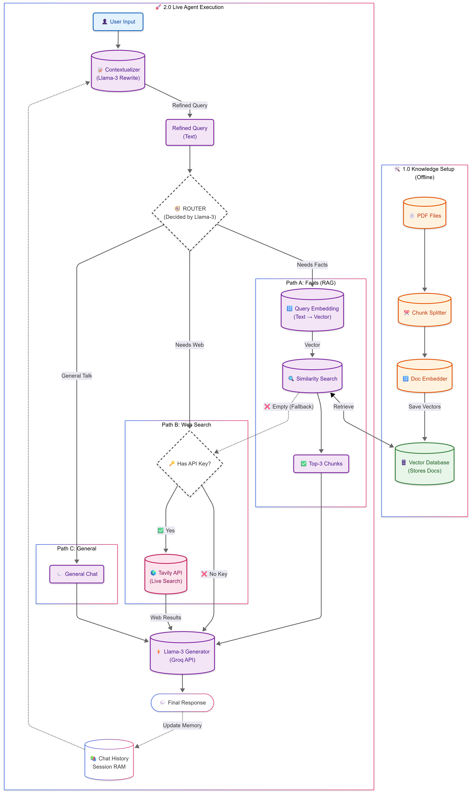

# 🧠 Agentic RAG: Intelligent Hybrid Search System


> **A next-generation Research Assistant that autonomously decides whether to read your documents or search the web.**

---

## 📸 System Architecture



### 🧩 Mermaid (Detailed + Easy-to-Understand)

For a more detailed, visually clear architecture (multiple Mermaid views), see:

- **docs/architecture_mermaid.md**

---

## 🚀 Overview

Standard RAG (Retrieval Augmented Generation) systems are limited—they only know what you upload. **Agentic RAG Hybrid** breaks this barrier by acting as an **autonomous agent**.

It possesses a "Brain" (Router) that evaluates every user query in real-time. If your uploaded PDFs contain the answer, it retrieves it with citation. If the query requires current events (e.g., _"Latest stock price"_) or public knowledge, it seamlessly switches to a **Live Web Search**.

### **Why is this better?**

- **Zero Hallucinations:** If the PDF lacks the answer, it doesn't make one up. It reports "Missing Info" and triggers a web search.
- **Context Aware:** It understands conversation history (e.g., "Who is he?" -> "Prabhas").
- **Self-Correcting:** If a search fails, it falls back to general logic or alternative strategies.

---

## ✨ Key Features

### 🧠 **1. Intelligent Routing**

The system classifies user intent into three streams:

- **📚 RAG Mode:** For specific questions about uploaded files (Legal docs, Manuals, Reports).
- **🌍 Web Mode:** For questions about live events, news, or public figures (via Tavily API).
- **💬 Chat Mode:** For greetings, coding tasks, or logic puzzles.

### 🛡️ **2. Smart Fallback & Self-Correction**

The "Agentic" loop ensures reliability:

1.  **Check Local DB:** Always prioritizes your private data.
2.  **Verify Content:** If the retrieved text is irrelevant, the Agent rejects it.
3.  **Auto-Switch:** Automatically triggers a Web Search if the local DB fails.

### ⚡ **3. High-Performance Tech Stack**

- **Inference:** Powered by **Groq** for lightning-fast Llama-3 responses.
- **Storage:** Uses **FAISS** (Facebook AI Similarity Search) for vector storage.
- **Ingestion:** **PyMuPDF** for 10x faster PDF parsing compared to standard loaders.

---

## 🛠️ Installation Guide

### Prerequisites

- Python 3.10+
- Groq API Key (Free tier available)
- Tavily API Key (Free tier available)

### 1. Clone the Repository

```bash
git clone [https://github.com/tsanhith/Agentic-RAG-Hybrid.git](https://github.com/tsanhith/Agentic-RAG-Hybrid.git)
cd Agentic-RAG-Hybrid
```
