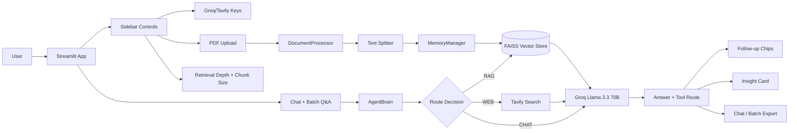
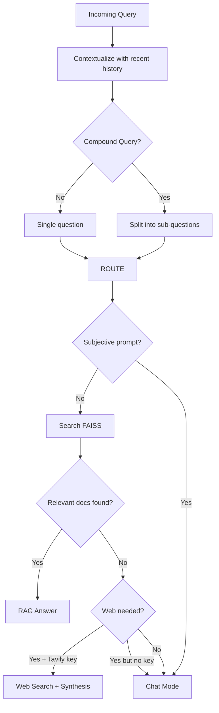

# Agentic RAG Hybrid... 


> **A smart Research Assistant that prioritizes your private documents, seamlessly falling back to the web only when your local knowledge is insufficient..!**

---

## Table of Contents
- [Why This Project](#why-this-project)
- [Core Capabilities](#core-capabilities)
- [Architecture](#architecture)
- [How It Works](#how-it-works)
- [Tech Stack](#tech-stack)
- [Project Structure](#project-structure)
- [Quick Start](#quick-start)
- [Usage Walkthrough](#usage-walkthrough)
- [Configuration Guide](#configuration-guide)
- [CI/CD Pipeline](#cicd-pipeline)
- [Privacy and Security Notes](#privacy-and-security-notes)
- [Troubleshooting](#troubleshooting)
- [Known Limitations](#known-limitations)
- [Roadmap Ideas](#roadmap-ideas)

---

## Why This Project

Most RAG demos are either:
- good at private docs but blind to current events, or
- good at web answers but weak on grounded citations.

**Agentic RAG Hybrid** bridges both worlds with a routing strategy:
1. Try document retrieval first.
2. If retrieval is weak or missing, decide if web data is needed.
3. Use Tavily search for freshness-sensitive questions.
4. Fall back to general chat mode when web is not required.

This gives better practical reliability for real workflows like:
- research assistants
- policy/document analysis
- briefing generation
- multi-question batch analysis

---

## Core Capabilities

### 1. Hybrid Router (RAG -> Web -> Chat)
- Contextualizes queries using recent chat history.
- Splits compound queries when detected.
- Searches local FAISS index first (`score_threshold=1.5`).
- Uses web search for recency-sensitive prompts (`latest`, `today`, `news`, etc.).
- Returns mode labels: `RAG`, `WEB`, `CHAT`, `MIXED`.

### 2. Source-Aware Response Experience
- Displays source badges with match confidence.
- Shows semantic comparison charts (`Query` vs `Source` embedding dimensions).
- Includes source previews in expandable analysis blocks.

### 3. AI Follow-up Question Chips
- Generates 3 high-value next questions after every assistant answer.
- One-click chip execution auto-runs the next prompt.
- Suggestions are cached and persisted in chat history.

### 4. AI Insight Cards (Executive Layer)
- Optional auto-generated insight card for each answer.
- Structured output:
  - `TL;DR`
  - `Next Best Actions`
  - `Risks / Unknowns`
  - `Confidence`
- Each card is individually downloadable as Markdown.

### 5. Batch Q&A Lab
- Paste multiple questions (one per line), run them in one click.
- Supports up to **8 questions** per batch run.
- Produces:
  - per-question answers
  - route labels
  - optional insight cards
  - follow-up suggestions
- Export formats:
  - Batch report (`.md`)
  - Structured dataset (`.csv`)
- Optional “Append batch results to chat”.

### 6. Export-First Workflow
- Download full chat transcript as Markdown.
- Export includes tool-route metadata and insight sections when available.

### 7. Polished Streamlit UI
- Modern, branded layout with custom styling.
- Sidebar control center for keys, ingestion, tuning, and session tools.
- Visual signal via progress bars, statuses, route pills, and metrics.

### 8. CI Baseline with GitHub Actions
- Automatic workflow on push and pull request.
- Installs dependencies.
- Runs syntax sanity check via `python -m compileall main.py src`.

---

## Architecture

### System Overview

```mermaid
flowchart LR
    U[User] --> UI[Streamlit App]
    UI --> SIDEBAR[Sidebar Controls]
    UI --> CHAT[Chat + Batch Q&A]

    SIDEBAR --> KEYS[Groq/Tavily Keys]
    SIDEBAR --> FILES[PDF Upload]
    SIDEBAR --> TUNING[Retrieval Depth + Chunk Size]

    FILES --> PROCESSOR[DocumentProcessor]
    PROCESSOR --> SPLIT[Text Splitter]
    SPLIT --> MEMORY[MemoryManager]
    MEMORY --> FAISS[(FAISS Vector Store)]

    CHAT --> AGENT[AgentBrain]
    AGENT --> ROUTER{Route Decision}
    ROUTER -->|RAG| FAISS
    ROUTER -->|WEB| TAVILY[Tavily Search]
    ROUTER -->|CHAT| LLM
    FAISS --> LLM[Groq Llama 3.3 70B]
    TAVILY --> LLM
    LLM --> ANSWER[Answer + Tool Route]
    ANSWER --> FOLLOWUPS[Follow-up Chips]
    ANSWER --> INSIGHTS[Insight Card]
    ANSWER --> EXPORTS[Chat / Batch Export]
```

### Query Decision Flow

```mermaid
flowchart TD
    Q[Incoming Query] --> C[Contextualize with recent history]
    C --> S{Compound Query?}
    S -->|Yes| SQ[Split into sub-questions]
    S -->|No| ONE[Single question]
    SQ --> ROUTE
    ONE --> ROUTE

    ROUTE --> SUBJ{Subjective prompt?}
    SUBJ -->|Yes| CHAT[Chat Mode]
    SUBJ -->|No| RAGTRY[Search FAISS]
    RAGTRY --> FOUND{Relevant docs found?}
    FOUND -->|Yes| RAG[RAG Answer]
    FOUND -->|No| NEEDWEB{Web needed?}
    NEEDWEB -->|Yes + Tavily key| WEB[Web Search + Synthesis]
    NEEDWEB -->|No| CHAT
    NEEDWEB -->|Yes but no key| CHAT
```

---

## How It Works

1. **Ingestion**
   - PDFs are loaded using `PyMuPDFLoader`.
   - Documents are split (`RecursiveCharacterTextSplitter`, overlap `200`).
   - Chunks are embedded with `all-MiniLM-L6-v2`.
   - Chunks are stored in FAISS.

2. **Query Understanding**
   - The model rewrites the question into a standalone query.
   - Last chat turns are used for pronoun/context resolution.
   - Compound prompts can be split into sub-questions.

3. **Answer Routing**
   - Attempt local retrieval first.
   - If retrieval misses and web indicators are present, call Tavily.
   - If web not needed or unavailable, use chat fallback.

4. **Answer Enhancement**
   - Route badge (`Documents`, `Internet`, `Logic`, `Mixed`).
   - Source confidence and semantic comparison chart (for RAG flows).
   - AI Insight Card and AI follow-up chips.

5. **Output and Reporting**
   - Chat export (`.md`)
   - Batch report export (`.md`) and (`.csv`)

---

## Tech Stack

| Layer | Technology |
|---|---|
| App UI | Streamlit |
| LLM orchestration | LangChain |
| Inference | Groq (`llama-3.3-70b-versatile`) |
| Web search | Tavily |
| Embeddings | HuggingFace (`all-MiniLM-L6-v2`) |
| Vector DB | FAISS (CPU) |
| PDF ingestion | PyMuPDF |
| Charts | Altair + pandas |
| CI | GitHub Actions |

---

## Project Structure

```text
.
├── .github/
│   └── workflows/
│       └── ci.yml
├── docs/
├── src/
│   ├── core/
│   │   ├── agent.py
│   │   ├── memory.py
│   │   └── processing.py
│   └── ui/
│       ├── layout.py
│       └── visuals.py
├── main.py
├── requirements.txt
└── README.md
```

---

## Quick Start

### Prerequisites
- Python 3.10+
- Groq API key (required): [console.groq.com/keys](https://console.groq.com/keys)
- Tavily API key (optional for web routing): [app.tavily.com/home](https://app.tavily.com/home)

### Setup
```bash
git clone https://github.com/tsanhith/Agentic-RAG-Hybrid.git
cd Agentic-RAG-Hybrid

python -m venv .venv
source .venv/bin/activate  # Windows: .venv\Scripts\activate

pip install --upgrade pip
pip install -r requirements.txt
```

### Run
```bash
streamlit run main.py
```

---

## Usage Walkthrough

### 1. Configure keys
- Open the sidebar.
- Enter Groq API key.
- Optionally add Tavily key for live web search.

### 2. Build your knowledge base
- Upload one or more PDFs.
- Set:
  - `Retrieval Depth (Chunks)`
  - `Chunk Size (Characters)`
- Click `Process Files`.

### 3. Ask questions normally
- Use chat input.
- Inspect route pill and source analysis for grounded answers.
- Click suggested follow-up chips to continue quickly.

### 4. Use Insight Cards
- Keep `Auto Insight Cards` enabled.
- Review TL;DR, actions, risks, and confidence.
- Download individual insight notes.

### 5. Use Batch Q&A Lab
- Open `Batch Q&A Lab` in sidebar.
- Paste one question per line.
- Run batch and download `.md` or `.csv` output.

---

## Configuration Guide

### Retrieval Depth (`k`)
- Higher `k` improves recall but increases context size and latency.
- Useful range in this app: `1 - 10`.

### Chunk Size
- Smaller chunks improve precision.
- Larger chunks preserve context.
- Current slider range: `200 - 2000` chars.

### Auto Insight Cards
- Enable for executive summaries and action framing.
- Disable if you want minimum generation overhead.

### Batch Q&A Limits
- Max questions per run: **8**
- Duplicate lines are de-duplicated.

---

## CI/CD Pipeline

Workflow file: [`.github/workflows/ci.yml`](.github/workflows/ci.yml)

### Trigger conditions
- Push to:
  - `main`
  - `codex/**`
- Pull requests targeting `main`

### Current CI job
1. Checkout repository
2. Setup Python `3.11`
3. Install dependencies (`pip install -r requirements.txt`)
4. Run syntax sanity check:
   - `python -m compileall main.py src`

This is intentionally simple and fast. You can extend with linting and test jobs later.

---

## Privacy and Security Notes

- Document embeddings are stored in-memory FAISS during session runtime.
- API keys are provided through the UI and held in Streamlit session state.
- Web search is optional and only used when routing conditions are met.
- For sensitive deployments, run in private infrastructure and add auth.

---

## Troubleshooting

### App does not answer anything useful
- Ensure Groq key is valid.
- Upload and process at least one PDF for document-grounded answers.
- Add Tavily key if you need live web results.

### No sources shown
- Source panels appear only when route is `RAG` or `MIXED` with retrieved docs.

### Batch run returns fallback answers
- Happens when no docs are indexed and no Tavily key is set.

### CI fails on dependency install
- Check package compatibility with the selected Python version.
- Re-run locally with:
  - `pip install -r requirements.txt`
  - `python -m compileall main.py src`

---

## Known Limitations

- No formal automated test suite yet (CI currently does syntax checks).
- Vector store is session-local (not persisted to an external database).
- Query classification/routing is heuristic-based in parts.
- Web retrieval quality depends on Tavily results and connectivity.

---

## Roadmap Ideas

- Persist FAISS index and session metadata.
- Add regression tests for routing and fallback behavior.
- Add document-level metadata filters (source/date/tags).
- Add auth + user workspaces for multi-tenant usage.
- Add observability dashboards (latency, route frequency, error rates).

---

If this project helps you, consider starring the repo and opening an issue/PR for enhancements.
