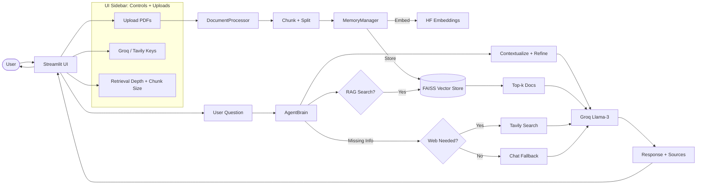
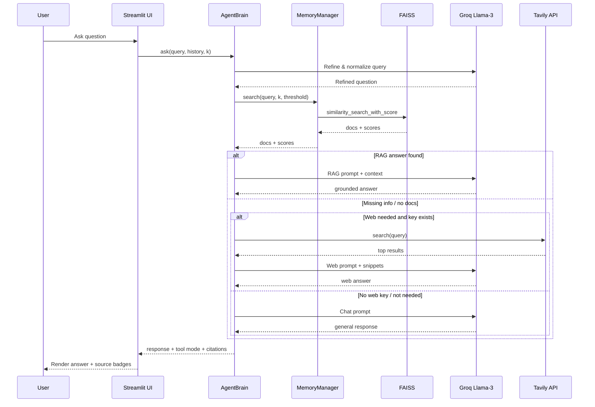
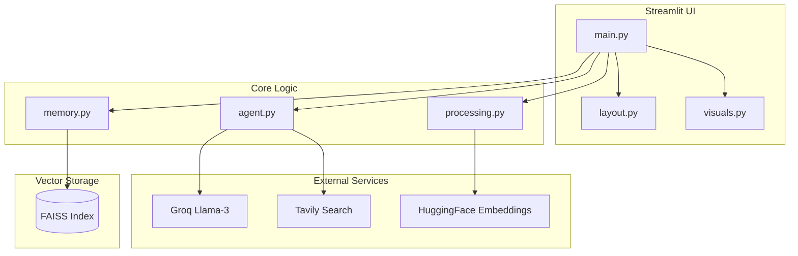
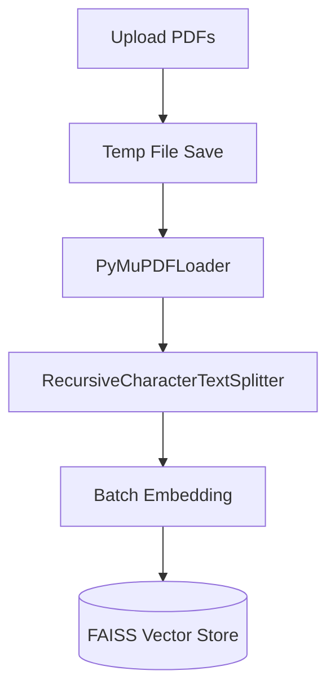
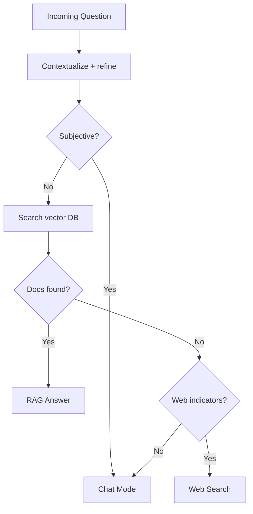

# 🧠 Agentic RAG Hybrid — Detailed Architecture (Mermaid)

This document provides a **detailed, visually clear Mermaid architecture** for the Agentic RAG Hybrid system. The diagrams are based on the current code flow and module layout.

---

## 1) 🌈 High-Level Experience Map (User Journey + System Routing)

---

## 2) 🧩 Detailed Runtime Sequence (Query Execution)

---

## 3) 🧱 Component Map (Modules + External Services)

---

## 4) 🔁 Ingestion Pipeline (Document Processing)

---

## 5) 🧠 Decision Policy (Routing Logic)

---

### ✅ Tips for Rendering
- Paste each Mermaid block into a Mermaid-compatible renderer (GitHub, Mermaid Live Editor, Obsidian, or VS Code with Mermaid support).
- Use **dark theme** for a more cinematic feel.
